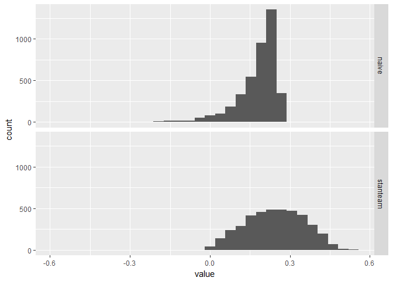

Test *R*<sup>2</sup> calculation
================
TJ Mahr
July 26, 2017

This document is just my (tjmahr's) notes on the article... I have nothing to do with its the paper besides being a studious reader.

------------------------------------------------------------------------

I'm curious how the calculation of *R*<sup>2</sup> compares to a function I wrote for my own analyses.

This code is the function by the Stan Team.

``` r
library(rstanarm)
#> Loading required package: Rcpp
#> Warning: package 'Rcpp' was built under R version 3.4.1
#> rstanarm (Version 2.15.3, packaged: 2017-04-29 06:18:44 UTC)
#> - Do not expect the default priors to remain the same in future rstanarm versions.
#> Thus, R scripts should specify priors explicitly, even if they are just the defaults.
#> - For execution on a local, multicore CPU with excess RAM we recommend calling
#> options(mc.cores = parallel::detectCores())
library(ggplot2)
library(bayesplot)
#> This is bayesplot version 1.2.0

# Compute Bayesian R-squared for linear and
# generalized linear models.
#
# @param fit A fitted model object returned by stan_glm.
# @return A vector of R-squared values with length equal to
#      the number of posterior draws.
#
bayes_R2 <- function(fit) {
  y <- get_y(fit)
  ypred <- posterior_linpred(fit, transform = TRUE)
  if (family(fit)$family == "binomial" && NCOL(y) == 2) {
    trials <- rowSums(y)
    y <- y[, 1]
    ypred <- ypred %*% diag(trials)
  }
  e <- -1 * sweep(ypred, 2, y)
  var_ypred <- apply(ypred, 1, var)
  var_e <- apply(e, 1, var)
  var_ypred / (var_ypred + var_e)
}
```

Here's the classical values.

``` r
library(dplyr)
#> Warning: package 'dplyr' was built under R version 3.4.1
#> 
#> Attaching package: 'dplyr'
#> The following objects are masked from 'package:stats':
#> 
#>     filter, lag
#> The following objects are masked from 'package:base':
#> 
#>     intersect, setdiff, setequal, union

m_glm <- glm(weight ~ group, PlantGrowth, family = gaussian())
modelr::rsquare(m_glm, PlantGrowth)
#> [1] 0.2641483

m_lm <- lm(weight ~ group, PlantGrowth)
modelr::rsquare(m_lm, PlantGrowth)
#> [1] 0.2641483
```

Here's my calculation.

``` r
m <- stan_glm(weight ~ group, PlantGrowth, family = gaussian(), prior = normal(0, 1))
#> trying deprecated constructor; please alert package maintainer
#> 
#> SAMPLING FOR MODEL 'continuous' NOW (CHAIN 1).
#> 
#> Gradient evaluation took 0 seconds
#> 1000 transitions using 10 leapfrog steps per transition would take 0 seconds.
#> Adjust your expectations accordingly!
#> 
#> 
#> Iteration:    1 / 2000 [  0%]  (Warmup)
#> Iteration:  200 / 2000 [ 10%]  (Warmup)
#> Iteration:  400 / 2000 [ 20%]  (Warmup)
#> Iteration:  600 / 2000 [ 30%]  (Warmup)
#> Iteration:  800 / 2000 [ 40%]  (Warmup)
#> Iteration: 1000 / 2000 [ 50%]  (Warmup)
#> Iteration: 1001 / 2000 [ 50%]  (Sampling)
#> Iteration: 1200 / 2000 [ 60%]  (Sampling)
#> Iteration: 1400 / 2000 [ 70%]  (Sampling)
#> Iteration: 1600 / 2000 [ 80%]  (Sampling)
#> Iteration: 1800 / 2000 [ 90%]  (Sampling)
#> Iteration: 2000 / 2000 [100%]  (Sampling)
#> 
#>  Elapsed Time: 0.078 seconds (Warm-up)
#>                0.064 seconds (Sampling)
#>                0.142 seconds (Total)
#> 
#> 
#> SAMPLING FOR MODEL 'continuous' NOW (CHAIN 2).
#> 
#> Gradient evaluation took 0 seconds
#> 1000 transitions using 10 leapfrog steps per transition would take 0 seconds.
#> Adjust your expectations accordingly!
#> 
#> 
#> Iteration:    1 / 2000 [  0%]  (Warmup)
#> Iteration:  200 / 2000 [ 10%]  (Warmup)
#> Iteration:  400 / 2000 [ 20%]  (Warmup)
#> Iteration:  600 / 2000 [ 30%]  (Warmup)
#> Iteration:  800 / 2000 [ 40%]  (Warmup)
#> Iteration: 1000 / 2000 [ 50%]  (Warmup)
#> Iteration: 1001 / 2000 [ 50%]  (Sampling)
#> Iteration: 1200 / 2000 [ 60%]  (Sampling)
#> Iteration: 1400 / 2000 [ 70%]  (Sampling)
#> Iteration: 1600 / 2000 [ 80%]  (Sampling)
#> Iteration: 1800 / 2000 [ 90%]  (Sampling)
#> Iteration: 2000 / 2000 [100%]  (Sampling)
#> 
#>  Elapsed Time: 0.072 seconds (Warm-up)
#>                0.084 seconds (Sampling)
#>                0.156 seconds (Total)
#> 
#> 
#> SAMPLING FOR MODEL 'continuous' NOW (CHAIN 3).
#> 
#> Gradient evaluation took 0 seconds
#> 1000 transitions using 10 leapfrog steps per transition would take 0 seconds.
#> Adjust your expectations accordingly!
#> 
#> 
#> Iteration:    1 / 2000 [  0%]  (Warmup)
#> Iteration:  200 / 2000 [ 10%]  (Warmup)
#> Iteration:  400 / 2000 [ 20%]  (Warmup)
#> Iteration:  600 / 2000 [ 30%]  (Warmup)
#> Iteration:  800 / 2000 [ 40%]  (Warmup)
#> Iteration: 1000 / 2000 [ 50%]  (Warmup)
#> Iteration: 1001 / 2000 [ 50%]  (Sampling)
#> Iteration: 1200 / 2000 [ 60%]  (Sampling)
#> Iteration: 1400 / 2000 [ 70%]  (Sampling)
#> Iteration: 1600 / 2000 [ 80%]  (Sampling)
#> Iteration: 1800 / 2000 [ 90%]  (Sampling)
#> Iteration: 2000 / 2000 [100%]  (Sampling)
#> 
#>  Elapsed Time: 0.072 seconds (Warm-up)
#>                0.062 seconds (Sampling)
#>                0.134 seconds (Total)
#> 
#> 
#> SAMPLING FOR MODEL 'continuous' NOW (CHAIN 4).
#> 
#> Gradient evaluation took 0 seconds
#> 1000 transitions using 10 leapfrog steps per transition would take 0 seconds.
#> Adjust your expectations accordingly!
#> 
#> 
#> Iteration:    1 / 2000 [  0%]  (Warmup)
#> Iteration:  200 / 2000 [ 10%]  (Warmup)
#> Iteration:  400 / 2000 [ 20%]  (Warmup)
#> Iteration:  600 / 2000 [ 30%]  (Warmup)
#> Iteration:  800 / 2000 [ 40%]  (Warmup)
#> Iteration: 1000 / 2000 [ 50%]  (Warmup)
#> Iteration: 1001 / 2000 [ 50%]  (Sampling)
#> Iteration: 1200 / 2000 [ 60%]  (Sampling)
#> Iteration: 1400 / 2000 [ 70%]  (Sampling)
#> Iteration: 1600 / 2000 [ 80%]  (Sampling)
#> Iteration: 1800 / 2000 [ 90%]  (Sampling)
#> Iteration: 2000 / 2000 [100%]  (Sampling)
#> 
#>  Elapsed Time: 0.079 seconds (Warm-up)
#>                0.064 seconds (Sampling)
#>                0.143 seconds (Total)
m
#> stan_glm
#>  family:  gaussian [identity]
#>  formula: weight ~ group
#> ------
#> 
#> Estimates:
#>             Median MAD_SD
#> (Intercept)  5.0    0.2  
#> grouptrt1   -0.4    0.3  
#> grouptrt2    0.4    0.3  
#> sigma        0.6    0.1  
#> 
#> Sample avg. posterior predictive 
#> distribution of y (X = xbar):
#>          Median MAD_SD
#> mean_PPD 5.1    0.2   
#> 
#> ------
#> For info on the priors used see help('prior_summary.stanreg').

naive_r2 <- tristan::calculate_model_r2(m)
tristan::tidy_etdi(naive_r2, c(.95, .9, .8))
#> # A tibble: 3 x 5
#>       term interval density       lower     upper
#>      <chr>    <chr>   <dbl>       <dbl>     <dbl>
#> 1 naive_r2     ETDI    0.95 -0.02693632 0.2581332
#> 2 naive_r2     ETDI    0.90  0.02787169 0.2548266
#> 3 naive_r2     ETDI    0.80  0.08371842 0.2487197
tristan::tidy_median(naive_r2)
#> # A tibble: 1 x 3
#>       term estimate est_type
#>      <chr>    <dbl>    <chr>
#> 1 naive_r2 0.201293   median

# Point value
tristan::calculate_r2(PlantGrowth$weight, predict(m))
#> [1] 0.2624793
```

Here is theirs.

``` r
stanteam_r2 <- bayes_R2(m)
tristan::tidy_etdi(stanteam_r2, c(.95, .9, .8))
#> # A tibble: 3 x 5
#>          term interval density      lower     upper
#>         <chr>    <chr>   <dbl>      <dbl>     <dbl>
#> 1 stanteam_r2     ETDI    0.95 0.03952860 0.4370005
#> 2 stanteam_r2     ETDI    0.90 0.06054661 0.4169761
#> 3 stanteam_r2     ETDI    0.80 0.09390667 0.3857414
tristan::tidy_median(stanteam_r2)
#> # A tibble: 1 x 3
#>          term estimate est_type
#>         <chr>    <dbl>    <chr>
#> 1 stanteam_r2 0.245853   median
```

This is kind of nutty.

``` r
df <- list(naive = naive_r2,
  stanteam = stanteam_r2) %>% 
  tibble::enframe() %>% 
  tidyr::unnest(value)

library(ggplot2)

ggplot(df) + 
  aes(x = value) + 
  geom_histogram() + 
  theme_grey() + 
  facet_grid(name ~ .)
#> `stat_bin()` using `bins = 30`. Pick better value with `binwidth`.
```



It looks like their median value is comparable to the modal *R*<sup>2</sup> value in my implementation. That's nice... The median and interval stats in my implementation are kind of worthless because the median *R*<sup>2</sup> does not match the *R*<sup>2</sup> produced by the median model parameters..

To be clear, my naive implementation just does a really dumb calculation on each posterior sample. Conceptually, each sample is its own lm model and each model attains a certain *R*<sup>2</sup> value so we have a distribution of *R*<sup>2</sup> values.

``` r
tristan::calculate_model_r2
#> function(model) {
#>   fits <- rstanarm::posterior_linpred(model, transform = FALSE)
#>   ys <- model$y
#> 
#>   r2 <- apply(fits, 1, function(y_fits) calculate_r2(ys, y_fits))
#>   r2
#> }
#> <environment: namespace:tristan>

tristan::calculate_r2
#> function(y_obs, y_fits) {
#>   stopifnot(length(y_obs) == length(y_fits))
#>   # (z <- crossprod(1:4))    # = sum(1 + 2^2 + 3^2 + 4^2)
#>   resid_ss <- as.vector(crossprod(y_obs - y_fits))
#>   total_ss <- as.vector(crossprod(y_obs - mean(y_obs)))
#>   1 - (resid_ss / total_ss)
#> }
#> <environment: namespace:tristan>

# To convince myself that it works
y_obs <- m_lm$model$weight
y_fits <- predict(m_lm)

tristan::calculate_r2(y_obs, y_fits)
#> [1] 0.2641483
modelr::rsquare(m_lm, PlantGrowth)
#> [1] 0.2641483
```

To do... study what their implementation does.
